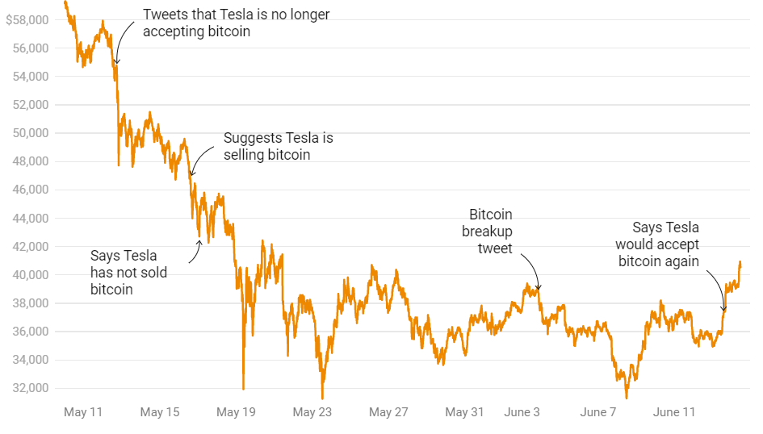

---
title: "Does Elon Musk's tweets influence Bitcoin market value? : A sentiment anaylsis approach"
author: "Beatrice Stocco - Federico Piazza - Luigi Negro"
date: "04/04/2022"
bibliography: allreferences.bib
always_allow_html: true
output:
  pdf_document:
    citation_package: biblatex
    latex_engine: xelatex
--- 

# Abstract


When Elon Musk speaks, bitcoin investors listen. The Tesla chief executive’s often-cryptic messages have sent bitcoin’s price on a roller-coaster during past years. Prices soared nearly 20% one January morning when he added “#bitcoin” to his Twitter biography. They jumped 16% in a single day the following month after Tesla Inc. revealed it bought $1.5 billion worth of the cryptocurrency. We present a textual analysis that explains how Elon Musk’s sentiments in his Twitter content correlates with price and volatility in the Bitcoin market using sentiment analysis and Augmented Dickey–Fuller (ADF) t-statistic test, allowing us to understand the (non-)stationarity of the bitcoin trends. After examining 4787 tweets containing 68676 words, posted from December 2011 to January 2021, and rigorously controlling other determinants, we found that the tone of the world’s wealthiest person can drive the Bitcoin market. In addition, Musk is likely to use positive words in his tweets, with great “trust” and “anticipation” as the most frequent sentiments expressed. However, we did not find evidence to support linkage between Musk’s sentiments and Bitcoin volatility.


# Literature review


# Introduction

On January 29, 2021, Elon Musk, at that time the richest person in the world (Klebnikov, 2021), unexpectedly changed the bio1 of his Twitter account to #bitcoin. The price of Bitcoin rose from about 32,000\$  to over 38,000\$ in a matter of hours, increasing the asset’s market capitalization by 111 billion \$ The relevance of Musk's tweets for financial markets has already become apparent in other contexts. Musk’s endorsement of the encrypted messaging service Signal (Musk, 2021a) led to investors purchasing the unrelated Signal Advance stock, increasing the latter’s market valuation from 55\$ million  to over 3\$ billion (DeCambre, 2021). These events clearly show the impact that leadership in social networks can have on financial markets and the decision-making behavior of (individual) investors.
While the market may read Musk's tweets on Tesla as "true news," his tweets regarding cryptocurrency reflect moods or personal sentiment, which have been shown to influence financial market pricing (Bollen et al., 2011; Gabrovek et al., 2017; Schumaker and Chen, 2009).
Musk declared that Bitcoin is "on the threshold of gaining broad acceptability" in a talk on social media site Clubhouse, and admitted that he is "late to the party but[...] a fan of Bitcoin." He also said in the event that his tweets about the cryptocurrency Dogecoin are just jokes (Krishnan et al., 2021). This is consistent with Musk's tweet from May 2020, in which he stated that he "only own[ed] 0.25 Bitcoins" (Musk, 2020). Tesla, on the other hand, spent $1.5 billion in Bitcoin between January and March 2021 (US Securities and Exchange Commission, 2021), implying that the Bitcoin-related tweets were more than "just jokes."
Musk's tweets appear to effect the cryptocurrency market, regardless of whether they are meant in fun or in earnest, which is our incentive to look into the topic further and analyse its consequences. While Musk is far from the only public figure to speak out on social media regarding cryptocurrency or financial markets, he is undoubtedly one of the most influential.
In strategic contacts between prominent individuals such as managers, journalists, or financial analysts and stakeholder groups, social media plays a key role (Heavey et al., 2020; Pfarrer et al., 2010). By communicating directly with customers (Alghawi et al., 2014), controlling the timing of disclosure (Jung et al., 2017), or establishing trust with investors or communities, these individuals can use their social networks to shape their own reputation and identity, or that of a related company (Deephouse, 2000; Zavyalova et al., 2012). (Elliott et al., 2018; Grant et al., 2018). Strategic leaders' social media activities, on the other hand, can generate a lot of ambiguity. For example, it may be difficult to tell whether a message is simply expressing a mood or conveying specific company-related information.
It could be hard to ascertain whether a message is merely expressing a mood or conveying specific company-related information. Furthermore, stakeholders may be overwhelmed with irrelevant information that diverts their attention away from the main concerns (Huang and Yeo, 2018). A person's or a company's reputation might be harmed as a result of critical behaviour. Because of the extremely quickly nature of social media, any such harm can occur in an instant (Wang et al., 2019).
Several research have looked into the relationship between cryptocurrency markets and social media activity, particularly on Twitter. Short-term Bitcoin liquidity is increased by an increase in the number of Bitcoin-related tweets (Choi, 2020), the number of Bitcoin-related tweets can explain Bitcoin trading volume and returns (Philippas et al., 2019; Shen et al., 2019), and Twitter sentiment can predict cryptocurrency returns (Philippas et al., 2019). (Kraaijeveld and De Smedt, 2020; Naeem et al., 2020; Steinert and Herff, 2018). According to Mai et al. (2018), social media users with less prior cryptocurrency-related involvement drive cryptocurrency effects, which makes sense because their actions are uncommon or unexpected. If Elon Musk tweeted about cryptocurrencies multiple times a day, the market would most certainly treat it as noise.
While several studies have looked into the impact of individual tweets on stock market returns (Brans and Scholtens, 2020; Ge et al., 2019—both relating to stock market-related tweets by Donald Trump), to our knowledge, very few researchers have examined into the impact of individual tweets on cryptocurrency returns and trading volume.

This research seeks to determine how one of the world's most powerful persons' social media activities affects cryptocurrency price levels. We take Elon Musk's cryptocurrency-related tweets and categorise them as unanticipated happenings. It is conceivable to evaluate the amount of any effect Musk's tweets had on the market by comparing past cryptocurrency market data to data surrounding these occurrences. The research looks at how leadership, engagement, and information via social media, particularly Twitter, influence investor attention and behaviour in cryptocurrency markets. Of course, Elon Musk is an outlier, which is why our approach might almost be termed a case study. In an ideal world, the findings and implications could be applied to other people and markets, allowing us to better understand the likelihood of social media personalities influencing cryptocurrency markets and whether or not this is a problem.

## Conceptual background: Financial market efficiency

"Prices fully represent all available information," according to the efficient market hypothesis (EMH) (Fama, 1970). The price of an item is determined by the intersection of a supply and demand curve, which satisfies both consumers (such as Bitcoin investors) and producers (e.g. Bitcoin miners). As additional relevant information becomes available, the curves adjust. A tweet from Elon Musk could be considered such new knowledge, and is priced appropriately if it is deemed important. However, the EMH's validity has been questioned because it is primarily reliant on market players' preferences and conduct. The adaptive markets hypothesis (AMH), a variant of the EMH, claims that the degree to which information is represented in prices is determined by market conditions as well as the quantity and characteristics of market participants: market effiency is context-dependent.
The quality of the information provided is a critical part of the impact of individuals on financial markets. According to signalling theory, an actor can employ high-quality signals to reduce market information uncertainty (Spence, 1973). While such signals are typically used in an agent's own interest, such as when applying for a job (Spence, 1973) or seeking entrepreneurial financing (Ante et al., 2018), it appears possible that a tweet from a very influential or reputable person is interpreted by a significant number of market participants as a signal of the quality of the object of the tweet, even without an ulterior motive or even unintentionally. Every tweet is motivated by something, even if it's just a passing mood. 
In this situation, having faith in the signal and its quality is critical. A signal must usually be coupled with direct or indirect expenses in order to be trustworthy or credible (Connelly et al., 2011). The costs in the instance of Elon Musk's tweets are indirect, and they include the potential damage to his reputation as a technological innovator and successful entrepreneur (i.e. his influencer status) or the reputation of the companies with which he is connected (Wang et al., 2019). There's also the possibility of counter-signaling, in which other agents broadcast contradictory or critical messages. If the market discovers, for example, that Musk's tweets are noise rather than quality signals, it should disregard the information as unimportant.


## Research questions

We raise the following research questions to address the issue of effciency in cryptocurrency markets and the attention their participants devote to influencers since Elon Musk and other influential individuals are likely to continue publicly commenting on cryptocurrency for the foreseeable future.


*RQ1: DO Elon Musk’s cryptocurrency-related tweets sentiments  have an effect on the pricing and trading volume of cryptocurrency?*

The answer to this issue can reveal whether tweets can be considered quality signals in general or whether the market effects seen were purely coincidental. Second, the AMH predicts that a cryptocurrency that is less efficient or liquid will be more affected by Musk's tweets.

*RQ2: Do sentiments and polarity of Musk’s cryptocurrency-related tweets differs by considering different time-frames?*

By answering these two study questions, we will be able to measure and better understand the impact of social media influencers on cryptocurrency markets, as well as draw some implications about how to interpret future events. Market participants will be able to better assess the significance of Musk's tweets and possibly other (social media) influencers in this way. Furthermore, the findings may contribute to broader study on the function of social media leaders in influencing investor behaviour, determining the quality of influencer content in the context of signalling theory, and determining influencer relevance for financial market efficiency.


# Data and methods 

## Popularity analysis 

The analysis is based on tweets by Elon Musk (twitter.com/elonmusk) between Jan 2011 to 2022. A data extraction has been conducted via python since some of its functions were more suitable for our purposes. The code used can be seen in the **Annex** section. Our dataframe resulted in total of 4787 tweets containing 68676 words over a time-span of 10 years.
As stated in the previous section, popularity and influence are critical factors to be assessed from market participants in order to assign a certain degree of reliability to the information they receive. That's why a first investigation has been conducted in this direction. Elon Musk's influece has been skyrocketing throughout the years, mainly due to the achievements linked  to his companies (namely Space X and Tesla) proving wrong many opponents who considered his goals too ambitious to be reached. On top of his professional achievements, his uncommon behavior, his funny character and his inspiring vision and leadership made his influence to grow sistematically. We used three proxies to quantify his popularity: namely, the *numbers of likes*, *number of replies* and *number of retweets* on Musk's tweets. These variables has been grouped by year in order to identify the trend clearly. As expected, his popularity has gained momentum especially after *2016*, when Tesla Model 3 was launched, some companies were renovated and gained momentum (i.e. SolarCity embedded in Tesla itself) and others were founded (i.e. Neuralink). 

## Bitcoin-related tweets

In a second step, a subset of the total population of tweets was made, in order to extract only tweets containing the word *bitcoin* and *cypto* so to direct our focus to Musk's influence on cryptomarkets Bitcoin-related. Exploiting the embedded time-stamp of these peculiar type of tweets, it could be possible to visualize in time when his tweets (events of interest) were located in respect to the Bitcoin market capitalization trend. At first sight, considerable variations can be highlighted after these events and further considerations will be found in the **Result** section. 

## Sentiment Analysis

Once obtained these data, they represented the input for our models: Sentiment Analysis and Polarization analysis were conducted, supported by wordclouds (in order to determine which were the most tweeted words). Through score assignment it has been possible to detect which were the most frequent sentiments in Musks's tweets, as well as the duration of these emotions. The results obtained through this first model helped us to understand the gradient of emotions provoked by Tesla CEO's tweets and therefore assessing those as drivers to his popularity and eventually his influence on cryptomarkets. 

## Testing for stationarity 

Finally, we wanted to investigate the presence of linkages between Elon Musk's sentiment and Bitcoin volatility: which means testing for stationarity. First of all, it is utmost important to determine how the series is behaving before applying any model to it: an Augmented Dicky Fuller test was used to evaluate how strongly a time series is defined by a trend. Results showed

### Hypothesis

*Null Hypothesis (H0)* : Null hypothesis of the test is that the time series can be represented by a unit root that is not stationary.
*Alternative Hypothesis (H1)*: Alternative Hypothesis of the test is that the time series is stationary.

**Why is Stationarity Important?**

Stationarity can be defined in precise mathematical terms, but for our purpose we mean a flat looking series, without trend, constant variance over time, a constant autocorrelation structure over time and no periodic fluctuations (seasonality).
For data to be stationary, the statistical properties of a system do not change over time. This does not mean that the values for each data point have to be the same, but the overall behavior of the data should remain constant.
If the data is non-stationary (meaning it has a trend), we need to remove it in order to proceed with the analysis. Various tecniques can be used to solve the issue of non-stationarity: after some attempts, the most succesful one has been to rely on the *log difference* of time values in Bitcoin price. 

[da concludere]


# Results


## Elon Musk's influence

As can be seen in the summary table below, Elon Musk's influnece has grown widely over the years. In 10 years, **number of replies** per tweet has grown up to more than 3 million, **number of retweets** up to more than 4 million and **number of likes** up to the astonishing numbers of more than 50 million. As of December 31st 2021, Elon Musk's follower amounted to 71.5 mln, which means a very high coverage of  $72,2%$. 


```{r, echo = FALSE}
if(!require(dplyr)) install.packages("dplyr")
if(!require(tidyverse)) install.packages("tidyverse")
if(!require(readxl)) install.packages("readxl")
library(dplyr)
library(tidyverse)

#library(readxl)
```

```{r, echo = FALSE}
elon =  read.csv("elon.csv")
dim(elon)
head(elon)

#create a dataset for analysing popularity

popularity = as.data.frame(cbind(elon$tweet, elon$nlikes, elon$nreplies, elon$nretweets, elon$date))
#change the col names
colnames(popularity) = c("tweet", "nlikes","nreplies", "nretweets", "date")

#Showing summaries of each variable

library(ggplot2)
library(dplyr)
#install.packages("hrbrthemes")

popularity$date <- format(as.POSIXct(popularity$date,format="%Y-%m-%d %H:%M:%OS"),format='%m/%d/%Y')
 

popularity$date <- as.Date(as.character(popularity$date), format='%m/%d/%Y')
popularity$nreplies= as.numeric(popularity$nreplies)
popularity$nretweets= as.numeric(popularity$nretweets)
popularity$nlikes= as.numeric(popularity$nlikes)


#grouping by year 

library(dplyr)

likes_year <- popularity %>%
mutate(dates = as.Date(popularity$date)) %>%
mutate(yr = format(dates, '%Y')) %>%
group_by(yr) %>%
summarise(nlikes=sum(nlikes))

retweet_year <- popularity %>%
mutate(dates = as.Date(popularity$date)) %>%
mutate(yr = format(dates, '%Y')) %>%
group_by(yr) %>%
summarise(nretweets = sum(nretweets))

nreplies_year <- popularity %>%
mutate(dates = as.Date(popularity$date)) %>%
mutate(yr = format(dates, '%Y')) %>%
group_by(yr) %>%
summarise(nreplies = sum(nreplies))

#removing year 2022 

nreplies_year= nreplies_year[-c(12), ]
retweet_year= retweet_year[-c(12), ]
likes_year= likes_year[-c(12), ]


```


```{r, echo = FALSE}

Replies = nreplies_year$nreplies
Likes =  likes_year$nlikes
Retweets = retweet_year$nretweets
summary(cbind(Replies, Retweets, Likes))
```

We can visually understand the exponential trend in the growing popularity of Tesla CEO's. It comes as no surprise that when *"Elon Musk speaks, investors listen"*. His influence derives from his large audience, prone to process the majority of the information coming from him as good quality information, influencing their (financial) decision-making process.

```{r, echo=FALSE}
library(ggplot2)
library(dplyr)

if(!require(hrbrthemes)) install.packages("hrbrthemes")
library(hrbrthemes)

#numeric 

nreplies_year$nreplies= as.numeric(nreplies_year$nreplies)
nreplies_year$yr= as.numeric(nreplies_year$yr)

retweet_year$yr = as.numeric(retweet_year$yr)
retweet_year$nretweets = as.numeric(retweet_year$nretweets)

likes_year$yr = as.numeric(likes_year$yr)
likes_year$nlikes = as.numeric(likes_year$nlikes)


#plot

library(ggplot2)
#install.packages("ggthemes")
library(ggthemes)

# Produce a bar chart
library(ggplot2)
library(ggthemes)


ggplot(data = likes_year, aes(x = yr, y = nlikes)) + 
  geom_bar(stat = "identity", width = 0.5, position = "dodge", fill = "darkorange", color = "black") + 
  xlab("Year") +
  ylab("Number of likes")  +
  ggtitle("Likes per year") +
  theme(plot.title = element_text(hjust = 0.5))

```

```{r, echo = FALSE}
ggplot(data =retweet_year, aes(x = yr, y = nretweets), color ="darkorange") + 
  geom_bar(stat = "identity", width = 0.5, position = "dodge", fill = "dark green", color = "black") + 
  xlab("Year") +
  ylab("Number of retweets") +  
   ggtitle("Retweets per year") +
  theme(plot.title = element_text(hjust = 0.5))
```


```{r, echo=FALSE}
ggplot(data = nreplies_year, aes(x = yr, y = nreplies)) + 
  geom_bar(stat = "identity", width = 0.5, position = "dodge", fill ="dark red", color ="black") + 
  xlab("Year") +
  ylab("Number of replies")  +  
   ggtitle("Replies per year") +
  theme(plot.title = element_text(hjust = 0.5))
```


```{r, echo = FALSE, results=FALSE}
# install.packages("devtools")
#devtools::install_github("sstoeckl/crypto2", force=TRUE)
library(crypto2)
library(dplyr)
library(lubridate)
#take daily hist of BTC
coins <- crypto_list(only_active=TRUE)
btc_hist <- crypto_history(coins, limit=1, start_date="20110101", end_date="20220131")

library(stringr)

as.data.frame(btc_hist)
btc_hist$timestamp <- format(as.POSIXct(btc_hist$timestamp,format="%Y-%m-%d %H:%M:%OS"),format='%m/%d/%Y')
btc_hist$timestamp <- as.Date(as.character(btc_hist$timestamp), format='%m/%d/%Y')


#subset tweets keeping those that contains ("bitcoin","crypto")
eloncrypto <- elon[grepl("crypto", elon[["tweet"]]) | grepl("BTC", elon[["tweet"]]),]
as.data.frame(eloncrypto)
eloncrypto$date <- format(as.POSIXct(eloncrypto$date,format="%Y-%m-%d %H:%M:%OS"),format='%m/%d/%Y')
eloncrypto$date <- as.Date(as.character(eloncrypto$date), format='%m/%d/%Y')
btc_hist['tweet'] <- btc_hist$timestamp %in% eloncrypto$date

```

## When Elon Musks tweets, investors listen

Once quantified Elon Musk's influence, it is essential to understand the extent of this influence on the cryptomarket. Which is the width of Bitcoin price volatility once a crypto-related tweets is published? We managed to extract the tweets which only cointained the words *bitcoin* and *crypto* and connected their time-stamp to the Bitcoin market capitalization trend. The pink points on the graphic represent the moment in time when a crpyto-related tweet was published: there is clear evidence suggesting a relationship between the Bitcoin volatility and Musk's trend however, it is still unclear at this stage whether it's Elon Musk's direct influence on Bitcoin price change or the other way round. It cannot be assessed a clear causality relatioship. This issue will be further addressed in this paper.

```{r, echo=FALSE}
library(ggplot2)
btc_hist %>%
ggplot(aes(x = timestamp, y = open)) +
geom_line() + 
geom_point(data = . %>% filter(tweet == TRUE), color = "deeppink", size = 3) +
ggtitle("Elon Musk's Tweets and Bitcoin Volatility") +
theme(plot.title = element_text(hjust = 0.5))
```


## Sentiment Analysis

While the market may interpret Musk's tweets about Tesla as “accurate news”, his tweets about cryptocurrency at least to some degree represent moods or personal sentiment. In this section we want to further analyze the nature of this sentiments, the most frequent words and the emotions associated to them.

```{r, echo=FALSE, results= FALSE}
if(!require(tm)) install.packages("tm")
library(tm)
library(RColorBrewer)
library(wordcloud)
corpus <- iconv(elon$tweet)
corpus <- Corpus(VectorSource(corpus))
inspect(corpus[1:5])
#clean
corpus <- tm_map(corpus, tolower)
corpus <- tm_map(corpus, removePunctuation)
corpus <- tm_map(corpus, removeNumbers)
cleanset <- tm_map(corpus, removeWords, stopwords('english'))
removeURL <- function(x) gsub('http[[:alnum:]]*', '', x)
cleanset <- tm_map(cleanset, content_transformer(removeURL))
inspect(cleanset[1:10])
#stemming = reduce to root form
cleanset <- tm_map(cleanset, stripWhitespace)
inspect(cleanset[1:5])
```
The graphs below shows the most used word and their frequency.
It appears that the three most used words are *amp*, *tesla* and *will*. 
It goes without saying that we expected **tesla** to be  one of the most frequent word in Musk's tweet, and our interpretation of the word **will** lies in that this verb shows his strong willingness and decisive, goal-oriented character as well as his inclination towards the future sustained by visionary statements. It can be less clear why **amp** is among the most frequent word, therefore we opted for a further explanation.


```{r, echo = FALSE}
tdm <- TermDocumentMatrix(cleanset)
tdm <- as.matrix(tdm)
tdm[1:10, 1:20]
words <- rowSums(tdm)
words <- subset(words, words>=100)
barplot(words,
        las = 2,
        col = rainbow(50))
```
*AMP* 

Amp is a universal collateral token designed to facilitate fast and efficient transfers for any real-world application. When using Amp as collateral, transfers of value are guaranteed and can settle instantly. While the underlying asset reaches final settlement, a process that can take anywhere from seconds to days, Amp is held in escrow by a collateral manager. Once the transaction successfully settles, the Amp collateral is released and made available to collateralize another transfer. Amp exists to serve as universal collateral for anyone and any project. (*Source [(https://docs.amptoken.org/)]* ).
Besides being a collateral for individuals and DeFi platforms, Amp is used as a collateral for payment networks: Flexa uses Amp to enable instant, fraud-free payments to merchants across its digital payment network. Apps that integrate Flexa stake Amp to ensure all payments can be settled in real-time regardless of the asset or protocol used. Since AMP Token was to be integrated with Tesla's payment rail for crypto, it is understandable why it's been one of the most tweeted words by Elon Musk, being this news shocking the crypto-lovers panorama and the future of Tesla. The news of Tesla about the willing to accept crypto as payments and the investment in over 1.5 BLN USD in Bitcoin  (February 2021), made the price of Bitcoin to skyrocket. On the other hand, a plethora of enviromental activists opposed this decision due to the high levels of electric energy which are used to mine and sustain the crypto network and highlighted the controversial nature of the Tesla CEO's choice: this led Elon Musk to no longer accept payments in Bitcoin. The impact on the crypto-currency value has been devastating has shown in the following graphic showing once again, how much "investors listen to Elon Musk".

image: 


Here follows a wordcloud which helped us to visualize the most frequent words in Elon Musk's tweets. The higher the word's size displayed, the most frequent the word would appear in his tweets.

```{r, echo = FALSE}
library(wordcloud)
w <- sort(rowSums(tdm), decreasing = TRUE)
set.seed(222)
wordcloud(words = names(w),
          freq = w,
          max.words = 150,
          random.order = F,
          min.freq = 5,
          colors = brewer.pal(8, 'Dark2'),
          scale = c(5, 0.3),
          rot.per = 0.7)
```

```{r}
if(!require(wordcloud2)) install.packages("wordcloud2")
library(wordcloud2)
w <- data.frame(names(w), w)
colnames(w) <- c('word', 'freq')
wordcloud2(w,
           size = 0.7,
           shape = 'rectangle',
           rotateRatio = 0.5,
           minSize = 1)
```

### Sentiment scores and density

Based on the following results of the Sentiment Analysis of Elon Musk's tweets, it appears clear that *positive*, *trust* and *anticipation* are the most frequent emotions. This result is perfectly coherent with the visionary Tesla and SpaceX CEO's personality: his hunger for innovative , out-of-the-box solutions; his continuous positive and confident approach towards insurmountable problems such as "taking the human race to Mars", conceiving re-usable rockets disrupting space industry,  as well as "changing the world's concept of driving through electric autonomous driven vehicle" and many others clearly embeds those emotions.

```{r, echo= FALSE}
library(syuzhet)
library(lubridate)
library(ggplot2)
library(scales)
library(reshape2)
library(dplyr)

s <- get_nrc_sentiment(elon$tweet)
head(s)
barplot(colSums(s),
        las = 2,
        col = rainbow(10),
        ylab = 'Count',
        main = 'Sentiment Scores Tweets')
```

```{r, echo=F, results = FALSE}
library(devtools) 
#install_github("trinker/sentimentr") 

txt <- elon$tweet
#txt cleaning

txt <- sapply(txt, function(x) iconv(x, to='UTF-8-MAC', sub='byte'))
#for Windows based OS
txt <- sapply(txt,function(row) iconv(row, "latin1", "ASCII", sub=""))
#remove punctuation
txt = gsub("(RT|via)((?:\\b\\W*@\\w+)+)", "", txt)
# remove at people
txt = gsub("@\\w+", "", txt)
# remove punctuation
txt = gsub("[[:punct:]]", "", txt)
# remove numbers
txt = gsub("[[:digit:]]", "", txt)
# remove html links
txt = gsub("http\\w+", "", txt)
# remove unnecessary spaces
txt = gsub("[ \t]{2,}", "", txt)
txt = gsub("^\\s+|\\s+$", "", txt)
txt = txt[!is.na(txt)]
names(txt) = NULL

library(sentimentr)
sentiment_by(txt) 

t = extract_sentiment_terms(txt) 


attributes(t)$count
```

Another important result is outlined by the following graphs. It shows the density of sentiment: as it can be noticed it follows a normal-like distribution ($\mu = 0.18$, $\sigma = 0.36 $), slightly positevely skewed. This result is line with the previous results, highlighting the positive polarity of the sentiments. Here follows a brief statistical summary of the density plot, followed by the plot itself.


```{r, echo = FALSE}
#Sentiment density plot
library(e1071)

txt %>%
get_sentences() %>%
sentiment() %>%
filter(sentiment!=0) -> senti

densitySentiments <- density(senti$sentiment) 
mean(senti$sentiment)
sd(senti$sentiment)
skewness(senti$sentiment)
plot(densitySentiments,main='Density of sentiments') 
polygon(densitySentiments,col='red')        
```
### Emotions at the sentence level

The following analysis detects the rate of emotion at the sentence level. This method uses a simple dictionary lookup to find emotion words and then compute the rate per sentence. The emotion score ranges between 0 (no emotion used) and 1 (all words used were emotional). Once again, this result is in line with the previous ones, showing how positive emotions such as joy, trust and anticipation are predominant. Please note that the suffix *_negated* indicates the opposite of the reference emotions, which appears to be consistently absent in relation to any emotion.

```{r, echo = FALSE}
e<-emotion_by(get_sentences(txt),drop.unused.emotions=TRUE)
plot(e)
```
## Testing for stationarity 

In this section we show the results obtained when testing for Bitcoin trend stationarity. We recall the hypothesis:

*Null Hypothesis (H0* : Null hypothesis of the test is that the time series can be represented by a unit root that is not stationary.
*Alternative Hypothesis (H1)*: Alternative Hypothesis of the test is that the time series is stationary. The following plot, represent our study focus.

```{r, echo = FALSE}
plot(btc_hist$timestamp,btc_hist$open,
     type='l',col='red',
     xlab = "time (t)",
     ylab = "Y(t)",
     main = "Trend signal")

```
### Autocorrelation Function

The autocorrelation function (ACF) defines how data points in a time series are related, on average, to the preceding data points (Box, Jenkins, & Reinsel, 1994). In other words, it measures the self-similarity of the signal over different delay times. An autocorrelation plot shows the value of the autocorrelation function (ACF) on the vertical axis. It can range from –1 to 1. We use autocorrelation plot to assess wether the elements of a time series randomly oscilates around zero.

Our first attempt without any transformation gives the following result, which shows consistent non-stationarity.
```{r, echo = FALSE}
acf(btc_hist$open,lag.max = length(btc_hist$open),
         xlab = "lag #", ylab = 'ACF', main=' ')
```
We proceed by applying an Augmented Dickey–Fuller (ADF) t-statistic test for unit root: in statistics and econometrics, an augmented Dickey–Fuller test (ADF) tests the null hypothesis that a unit root is present in a time series sample. The alternative hypothesis is different depending on which version of the test is used, but is usually stationarity or trend-stationarity. It is an augmented version of the Dickey–Fuller test for a larger and more complicated set of time series models.
The augmented Dickey–Fuller (ADF) statistic, used in the test, is a negative number. The more negative it is, the stronger the rejection of the hypothesis that there is a unit root at some level of confidence. Our result clearly shows a non-stationarity due to the high p-value (>0.5). 

```{r, echo = FALSE}
if(!require(tseries)) install.packages("tseries")
options(warn=-1)
library(tseries)

adf.test(btc_hist$open)
#data non stationary as high p-value
```

In order to go from non-stationarity to stationarity different techniques can be used. We first attempt in utilising logaritmic transformation: such transformtion can help to stabilise the variance of a time series. We apply the ADF test, still obtaining a non statistically relevant result, even though the p-value has decreased to 0.46.

```{r, echo = FALSE}
btc_hist['log'] = log(btc_hist$open)
plot(btc_hist$timestamp,btc_hist$log,
     type='l',col='red',
     xlab = "time (t)",
     ylab = "Y(t)",
     main = "Trend signal")
acf(btc_hist$log,lag.max = length(btc_hist$log),
         xlab = "lag #", ylab = 'ACF', main=' ')
adf.test(btc_hist$log)
```

Differencing log values can help stabilise the mean of a time series by removing changes in the level of a time series, and therefore eliminating (or reducing) trend and seasonality. We attempt to use this transformation obtaining satisfing results. Indeed, the following plot shows how the trend has been removed and stationarity is obtained.

```{r, echo= FALSE}
diff = diff(btc_hist$open)
logdiff = diff(btc_hist$log)

plot(btc_hist$timestamp[2:3200],diff,
     type='l',col='red',
     xlab = "time (t)",
     ylab = "Y(t)",
     main = "Trend signal")
acf(diff,lag.max = length(btc_hist$open),
         xlab = "lag #", ylab = 'ACF', main=' ')

```

We conduct the ADF test to confirm our results: p-value is now 0.01 (highly significant) and we can assess that the log difference of the elements of the time series result to be non-stationary. 
```{r, echo = FALSE}
adf.test(diff)
adf.test(logdiff)

```
 
This means that bitcoin volatility is random, not influenced by Elon Musk's tweets. This is a core finding of our study.

Da qui in poi fede guarda tu
--- 

try to find change points in the data, I use diff for now not sure tho

```{r}
if(!require(changepoint)) install.packages("changepoint")
library(changepoint)
library(tidyverse)
library(lubridate)
m_binseg <- cpt.mean(diff, penalty = "BIC", method = "BinSeg", Q = 15)

plot(m_binseg, type = "l", xlab = "Index", cpt.width = 4)
```

```{r}
cpts(m_binseg) 
```

```{r}
#all the changes happen from 2500 onwards approx, try to subset plot
m_binseg <- cpt.mean(diff[2500:3199], penalty = "BIC", method = "BinSeg", Q = 15)
plot(m_binseg, type = "l", xlab = "Index", cpt.width = 4)

```
try with differend methods: 

```{r}
#segmented neighbout
m_segneigh <- cpt.mean(diff[2500:3199], penalty = "BIC", method = "SegNeigh", Q = 50)
plot(m_segneigh, type = "l", xlab = "Index", cpt.width = 4)
 
```


```{r}
cpts(m_binseg)

```

```{r}
m_pelt <- cpt.mean(diff[2500:3199], penalty = "BIC", method = "PELT")
plot(m_pelt, type = "l", cpt.col = "blue", xlab = "Index", cpt.width = 4)

#maybe not best method lol


```

```{r}
m_pm <- cpt.mean(diff[2500:3199], penalty = "Manual", pen.value = "1.5 * log(n)",
                      method = "PELT")
plot(m_pm, type = "l", cpt.col = "blue", xlab = "Index", cpt.width = 4)
```

Those were only taking into consideration the mean, let's see the results for mean and variance all together

```{r}
#transform changepoints in dates
#we just sum it from the first day

cpt_date = btc_hist$timestamp[2499] + cpts(m_binseg) 
tweet_date = btc_hist %>% filter(tweet == TRUE) %>% select(timestamp)
as.data.frame(cpt_date)
```


```{r}
library(stringr)
sum(str_count(elon$tweet, "\\w+"))
```

# Conclusion

dfihdfhdhfidf


# Annex

*Python code to extract Elon Musks's tweets via Twitter API*

```{r, echo = TRUE, eval=FALSE }
import twint
import datetime

def delist(x):
    df = x[0]
    for i in range(1, len(x)):
        df = df.append(x[i])
    return df

def ElonPaginated():
    data = []
    start = datetime.datetime.strptime("2011-01-01", "%Y-%m-%d")
    end = datetime.datetime.strptime("2022-02-01", "%Y-%m-%d")
    date_generated = [start + datetime.timedelta(days=x) for x in range(0, (end - start).days)]
    date_generated = date_generated[::7]
    date_generated = [date_obj.strftime("%Y-%m-%d") for date_obj in date_generated]
    for i in range(0, len(date_generated) - 1):
        c = twint.Config()
        c.Username = "elonmusk"
        c.Since = date_generated[i]
        c.Until = date_generated[i + 1]
        c.Pandas = True
        twint.run.Search(c)
        Tweets_df = twint.storage.panda.Tweets_df
        if Tweets_df.empty:
            pass
        else: data.append((Tweets_df))
    return data

data = ElonPaginated()
data = delist(data)
print(data)
data.to_csv('/Users/federicopiazza/Desktop/MONTREAL/QM/elon.csv')
```


